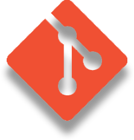

<h2 align="left">Selam millet </h2>
   
Ben <a href="https://batuhanacar.com.tr/">Batuhan!</a>

   
   
   

<h3>Kişisel bilgilerim:</h3>
<ul>
  <li>💻 Şuan onaylanmış bir marka olan Tibet & Petra sunucularında discord alanında geliştiricilik yapmaktayım. 🌙</li>
  <li>📫 Bana ulaşmak istiyorsan <a href="https://discord.com/users/966824431966105611" target"blank_">Discord</a> veya <a href="https://instagram.com/baend24" target="_blank">Instagram </a> adresimi kullanabilirsin 🤹</li>
</ul>
<h3>Çalışma alanlarım:</h3>

    
    
    
    
    
    
    

<h3 align="left">GitHub İstatistiklerim:</h3>

   
   

